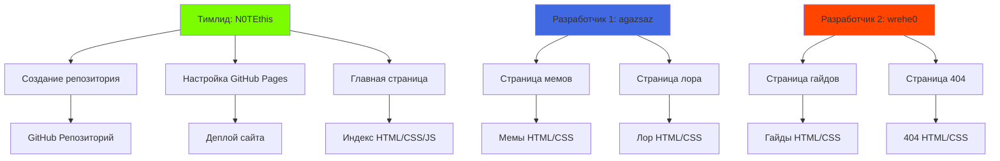

# Minecraft Meme Universe 🎮⛏️😂

[](https://yourusername.github.io/minecraft-meme-site/)
[](LICENSE)

Веб-сайт с мемами, лором и гайдами по Minecraft. Создан командой **BlockHeads** для фанатов квадратных приключений!

## 🌐 Демо сайта
Посетите наш сайт: [ https://n0tethis.github.io/miao00/](https://n0tethis.github.io/miao00/)

## 📁 Структура проекта
```
minecraft-meme-site/
├── 📄 index.html                 # Главная страница
├── 📄 memes.html                 # Страница с мемами
├── 📄 lore.html                  # Лор Minecraft
├── 📄 guides.html                # Гайды и советы
├── 📄 404.html                   # Страница 404 ошибки
│
├── 📁 css/                       # Стили
│   ├── 📄 style.css              # Основные стили
│   ├── 📄 reset.css              # Сброс стилей
│   └── 📄 responsive.css         # Адаптивные стили
│
├── 📁 js/                        # JavaScript
│   ├── 📄 main.js                # Основной скрипт
│   └── 📄 menu.js                # Навигационное меню
│
└── 📁 images/                    # Изображения
    ├── 📁 memes/                 # Мемы
    └── 📁 icons/                 # Иконки
```

## 👥 Команда BlockHeads

### Роли и ответственность


### Распределение задач
| Участник | Задачи | Технологии |
|----------|--------|------------|
| **N0TEthis** | Репозиторий, главная страница, настройка | HTML, CSS, Git |
| **agazsaz**  | Страницы мемов и лора | HTML, CSS, JavaScript |
| **wrehe0**| Страницы гайдов и 404 | HTML, CSS, GitHub Pages |

## 🚀 Как запустить локально

1. Клонируйте репозиторий:
```bash
git clone https://github.com/yourusername/minecraft-meme-site.git
```

2. Перейдите в директорию проекта:
```bash
cd minecraft-meme-site
```

3. Откройте `index.html` в браузере или используйте Live Server в VSCode

## 🛠 Технологии

- **HTML5** - Семантическая разметка
- **CSS3** - Flexbox, Grid, CSS Variables
- **JavaScript** - Интерактивность
- **Git** - Контроль версий
- **GitHub Pages** - Хостинг

## 📝 Особенности

✅ Полностью адаптивный дизайн  
✅ Интерактивные элементы  
✅ Анимации CSS  
✅ Мобильное меню  
✅ Случайный мем дня  
✅ Оптимизированные изображения  

## 🤝 Как внести вклад

1. Форкните репозиторий
2. Создайте ветку (`git checkout -b feature/AmazingFeature`)
3. Закоммитьте изменения (`git commit -m 'Add AmazingFeature'`)
4. Запушьте в ветку (`git push origin feature/AmazingFeature`)
5. Откройте Pull Request

## 📄 Лицензия

Этот проект лицензирован под MIT License - смотрите файл [LICENSE](LICENSE) для деталей.

## 📞 Контакты

Команда BlockHeads:
- GitHub: [@N0TEthis ](https://github.com/N0TEthis )
- Telegram: [@N0TE_this](@N0TE_this)
- Email: t5405656@yandex.ru

---
*Сделано с ❤️ и ⛏️ для сообщества Minecraft*